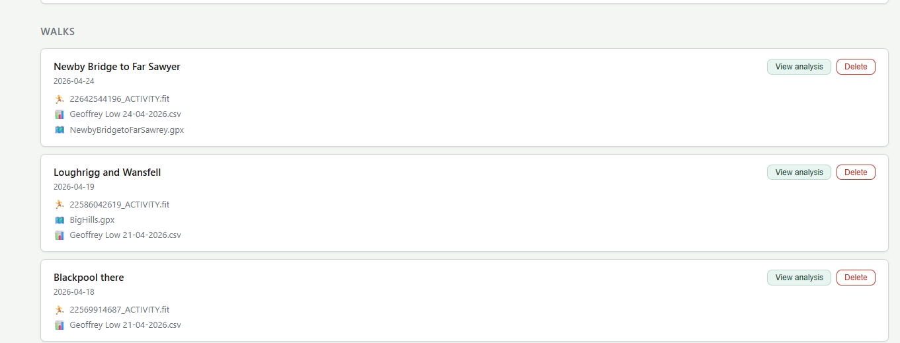
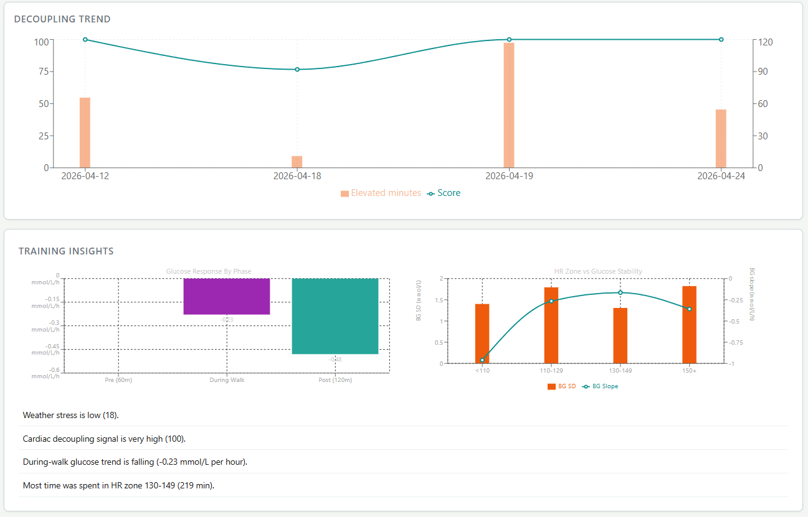
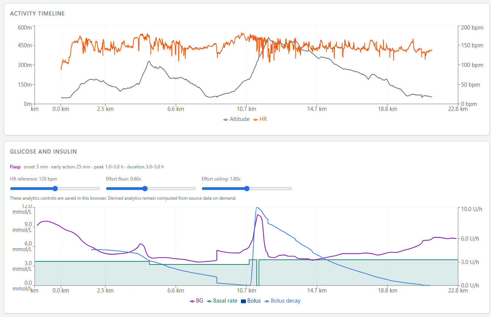
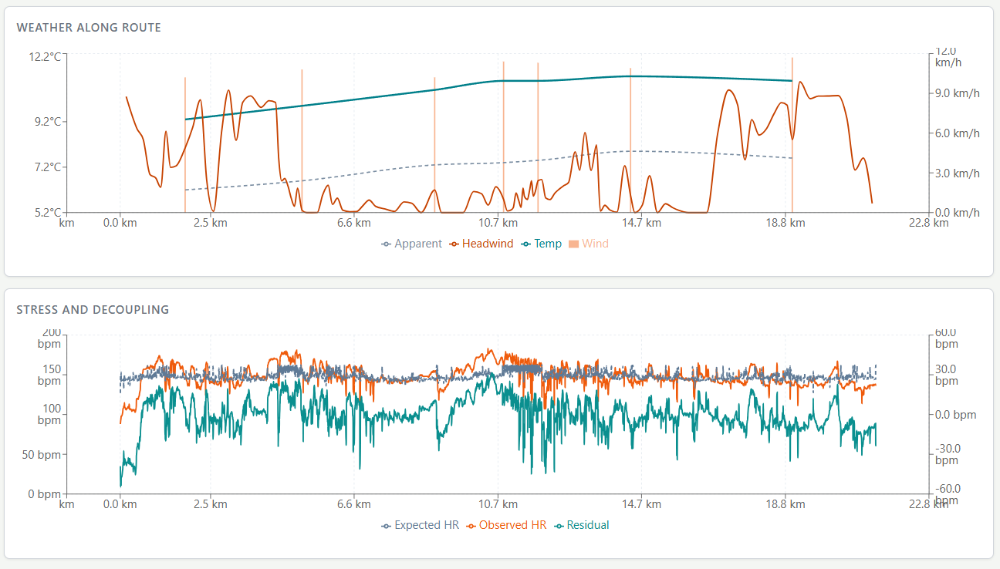
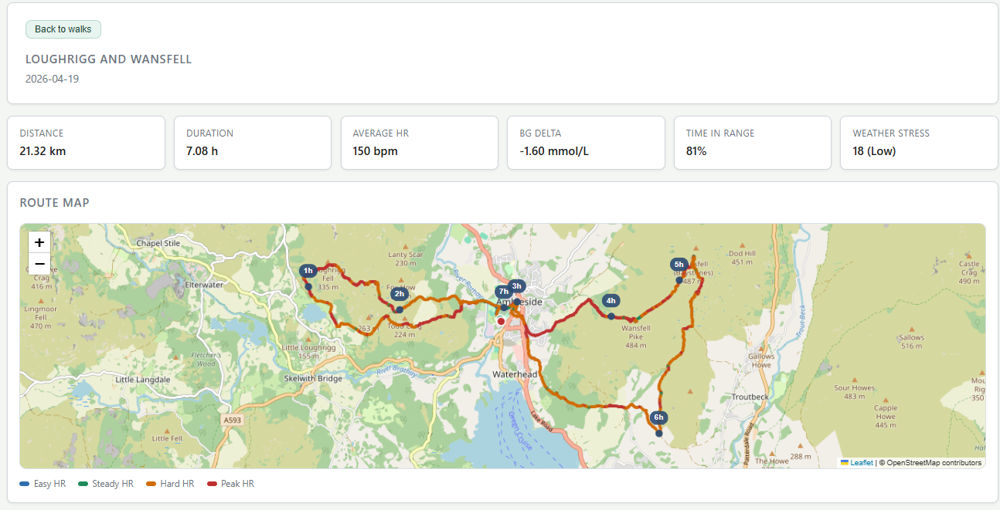
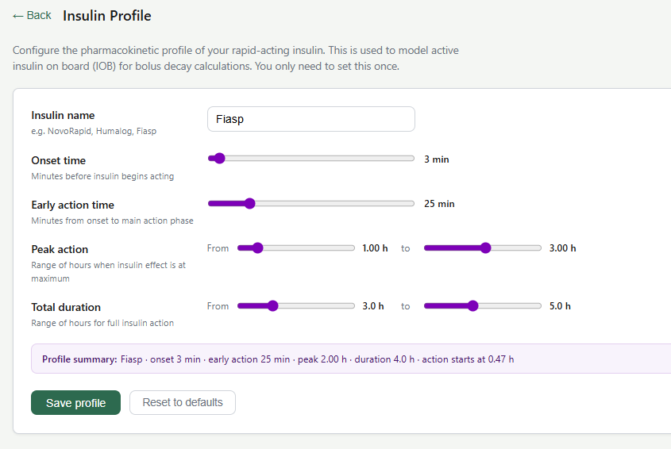
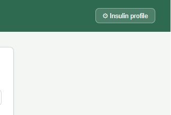

# Walkies

Walkies is a small web app for collecting walk files and generating analysis views that line up activity data with glucose and insulin data.

The current workflow is built around:

- Garmin FIT files for activity, route, heart rate, distance, and altitude
- CareLink CSV exports for glucose, basal rate, and bolus events
- Optional GPX files for route context

The app stores uploaded files by walk date and serves a single analysis view that combines:

- map rendering for the walk route
- stacked distance-aligned charts for altitude, heart rate, blood glucose, basal rate, and bolus events
- summary metrics for the walk window

## Screenshots

### Walk List



The landing page lists uploaded walks and gives quick access to analysis views and file management.

### Analysis Overview



The main analysis page aligns activity, glucose, insulin, and environmental data against route distance.

### Glucose And Insulin



This chart combines glucose readings, basal delivery, bolus events, and estimated active bolus insulin so changes in glucose can be interpreted against insulin exposure during the walk.

### Stress And Decoupling



This view compares observed heart rate with expected heart rate and highlights residual strain across the route.

### Map View



The map view shows the route coloured by heart-rate intensity, with hourly markers to show progress.

## Insulin Profile

Walkies includes a persistent insulin profile so the bolus decay curve can be tailored to the insulin you actually use rather than relying on a fixed generic duration.

### Profile Setup



The setup screen stores the insulin name, onset, early action, peak window, and total duration range in the browser. This only needs to be configured once unless you want to change the model.

### Profile Applied In Analysis



The selected insulin profile is then shown in the Glucose and Insulin panel and used to drive the active insulin curve drawn alongside basal and bolus data.

## Stack

- Backend: FastAPI
- Frontend: React + Vite
- Python environment: `uv`
- Task runner: `task`

## Project Layout

```text
walkies/
├── backend/
│   ├── main.py
│   ├── pyproject.toml
│   └── data/
├── frontend/
│   ├── package.json
│   └── src/
├── Taskfile.yml
└── README.md
```

## Requirements

- Python 3.11+
- Node.js
- `uv`
- `task`

## Getting Started

Install dependencies:

```bash
task install
```

Run both backend and frontend in development mode:

```bash
task
```

This starts:

- FastAPI on `http://localhost:8000`
- Vite on `http://localhost:5173`

The frontend uses the Vite dev proxy for `/api`, so requests are forwarded to the backend in development.

## Available Tasks

```bash
task           # start backend + frontend
task dev       # same as above
task backend   # backend only
task frontend  # frontend only
task install   # install backend + frontend dependencies
task build     # build the frontend
```

## Data Inputs

### Garmin FIT

Used for walk activity records including:

- timestamps
- GPS coordinates
- heart rate
- cumulative distance
- enhanced altitude

### CareLink CSV

Used for:

- sensor glucose / BG readings
- basal rate
- bolus volume delivered

### GPX

Optional route file used when a FIT track is unavailable.

## API Endpoints

- `GET /api/walks` - list stored walks
- `POST /api/walks/upload` - upload files for a walk date
- `DELETE /api/walks/{date}` - delete a walk
- `GET /api/walks/{date}/analysis` - render the analysis page
- `POST /api/walks/parse-fit-date` - extract a date from a FIT file

## Notes

- Walk files are stored under `backend/data/YYYY-MM-DD/`.
- The analysis page is currently generated server-side as standalone HTML.
- FIT parsing is implemented directly in the backend rather than through an external FIT library.

## License

This project is licensed under the MIT License. See the `LICENSE` file for details.